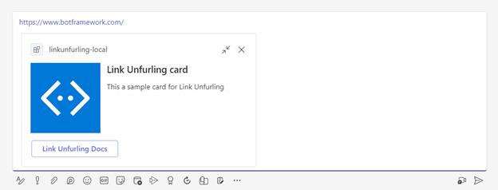
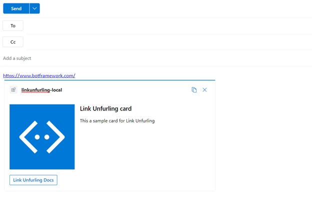

# Link Unfurling

## Introduction
This is an Link Unfurling app that can unfurl an adaptive card after user pastes a link. 

Teams:

Outlook:

## Prerequisites

- [Node.js](https://nodejs.org/), supported versions: 16, 18
- A Microsoft 365 account. If you do not have Microsoft 365 account, apply one from [Microsoft 365 developer program](https://developer.microsoft.com/en-us/microsoft-365/dev-program)
- [Teams Toolkit Visual Studio Code Extension](https://aka.ms/teams-toolkit) version 5.0.0 and higher or [TeamsFx CLI](https://aka.ms/teamsfx-cli)

## Getting Started

Run your app with local debugging by pressing `F5` in VSCode. Select `Debug in Teams` or `Debug in Outlook` depending on your preference.

## References

* [Extend a Teams message extension across Microsoft 365](https://docs.microsoft.com/microsoftteams/platform/m365-apps/extend-m365-teams-message-extension?tabs=manifest-teams-toolkit)
* [Bot Framework Documentation](https://docs.botframework.com/)
* [Teams Toolkit Documentations](https://docs.microsoft.com/microsoftteams/platform/toolkit/teams-toolkit-fundamentals)
* [Teams Toolkit CLI](https://docs.microsoft.com/microsoftteams/platform/toolkit/teamsfx-cli)
* [TeamsFx SDK](https://docs.microsoft.com/microsoftteams/platform/toolkit/teamsfx-sdk)
* [Teams Toolkit Samples](https://github.com/OfficeDev/TeamsFx-Samples)